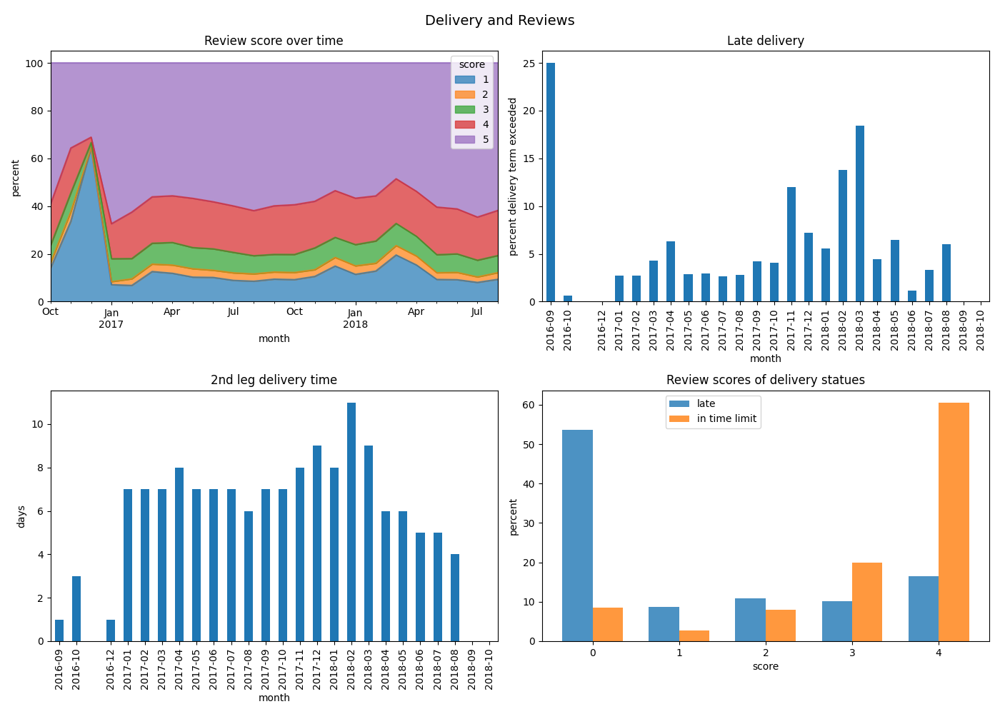

# Installation

1. install  [uv](https://docs.astral.sh/uv/getting-started/installation/)
2. `uv sync`
3. use any jupyter notebook IDE you know (VSCode, JupyterLab etc) and choose python in .venv of this folder as kernel

# Running

- copy `.env.example` → `.env` and fill in your Kaggle API key
- run all cells

# Results

- The logistics department request was fullfilled. Key insights, results and dashboard show the dynamic and correlation between delivery terms and reviews
- Review score to the share of delivery term longer than esitmated correlation is 0.31. The month with the most scores less than 5 coincides with month (and previous month) with the most late deliveries.
- The delivery term depends from carrier at most. Delays happen most because of 2nd leg time increase.
- Late deliveries get near as much 1 scores as in time deliveries 5 scores
- The expedition distance increase does not explain enhanced delivery term

# Recommendations

- It is very important to monitor delivery time as primary review score marker.
- 2nd leg should be monitored at most.
- Carriers should be monitored individually.

# Further investigation
- Geographical distirbution of delivery term violations should be studied more thouroughly as well as item categories.
- Other domains also should be checked.

